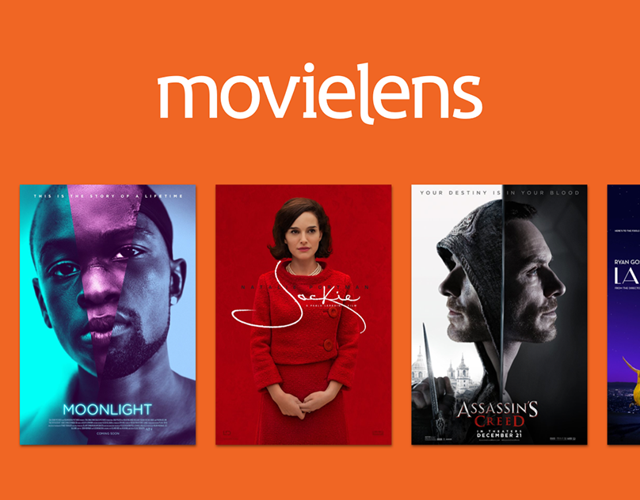

# Бизнес-проект

## Иннополис, 2024-25 учебный год

## Exploratory Data Analysis

## Формат выполнения

Проект представляет собой творческое инициативное индивидуальное задание.

## Оценивание

Проект оценивается исходя из устной защиты (презентации) перед комиссией.

Оценка ставится на основе факторов глубины проработки предметной области, сложности применяемых в проекте инструментов, а также прочих аспектов, связанных с содержанием выполняемого в проекте ТЗ. При выставлении оценки комиссия ориентируется на критерии, более подробно представленные ниже в разделе "Критерии оценки проекта".

## Описание задания

Предоставленный набор данных (ml-latest-small) описывает 5-звездочный рейтинг и отзывы в свободном форме от площадки **MovieLens** (http://movielens.org), сервиса рекомендаций по фильмам. Он содержит 100836 оценок и 3683 комментариев для 9742 фильмов. Эти данные были созданы 610 пользователями в период с 29 марта 1996 года по 24 сентября 2018 года. Сам набор данных был собран 26 сентября 2018 года.

Пользователи были выбраны случайным образом. Все выбранные пользователи оценили не менее 20 фильмов. Демографическая информация не включена. Каждый пользователь представлен идентификатором, и никакая другая информация о нем не предоставляется.

Данные содержатся в файлах `links.csv`, `movies.csv`, `ratings.csv` и `tags.csv`. Более подробная информация о содержании и использовании всех этих файлов приведена ниже.

Этот и другие наборы данных GroupLens общедоступны для скачивания по адресу <http://grouplens.org/datasets/>.

### Описание признаков

User Ids
--------

Пользователи MovieLens были выбраны случайным образом для включения. Их идентификаторы были анонимизированы. Идентификаторы пользователей совпадают между `ratings.csv` и `tags.csv` (т.е. один и тот же идентификатор относится к одному и тому же пользователю в обоих файлах).

Movie Ids
---------

В набор данных включаются только фильмы, имеющие хотя бы один рейтинг или тег. Идентификаторы фильмов соответствуют тем, которые используются на веб-сайте MovieLens (например, идентификатор `1` соответствует URL <https://movielens.org/movies/1>). Идентификаторы фильмов совпадают между `ratings.csv`, `tags.csv`, `movies.csv` и `links.csv` (т.е. один и тот же идентификатор относится к одному и тому же фильму в этих четырех файлах).

Ratings Data File Structure (ratings.csv)
-----------------------------------------

Все оценки содержатся в файле `ratings.csv`. Каждая строка этого файла после строки заголовка представляет одну оценку одного фильма одним пользователем и имеет следующий формат:

    userId, movieId, rating, timestamp

Строки в этом файле упорядочены сначала по userId, затем по MovieID.

Оценки выставляются по 5-бальной шкале с шагом в половину звезды (0.5 звезды - 5.0 звезды).

Временные метки представляют секунды, прошедшие с полуночи по всемирному координированному времени (UTC) 1 января 1970 года.

Tags Data File Structure (tags.csv)
-----------------------------------

Все теги содержатся в файле `tags.csv`. Каждая строка этого файла после строки заголовка представляет собой один тег, примененный к одному фильму одним пользователем, и имеет следующий формат:

    userId, movieId, tag, timestamp

Строки в этом файле упорядочены сначала по userId, затем по MovieID.

Теги — это созданные пользователем метаданные о фильмах. Каждый тег обычно представляет собой одно слово или короткую фразу. Смысл, ценность и назначение конкретного тега определяются каждым пользователем.

Временные метки представляют секунды, прошедшие с полуночи по всемирному координированному времени (UTC) 1 января 1970 года.

Movies Data File Structure (movies.csv)
---------------------------------------

Информация о фильме содержится в файле `movies.csv`. Каждая строка этого файла после строки заголовка представляет один фильм и имеет следующий формат:

    movieId, title, genres

Названия фильмов вводятся вручную или импортируются из <https://www.themoviedb.org/> и включают год выпуска в круглых скобках. В этих названиях могут содержаться ошибки и несоответствия.

Жанры представляют собой список, разделенный вертикальной чертой, и выбираются из следующего спсика:

* Action
* Adventure
* Animation
* Children's
* Comedy
* Crime
* Documentary
* Drama
* Fantasy
* Film-Noir
* Horror
* Musical
* Mystery
* Romance
* Sci-Fi
* Thriller
* War
* Western
* (no genres listed)

Links Data File Structure (links.csv)
---------------------------------------

Идентификаторы, которые можно использовать для ссылок на другие источники данных о фильмах, содержатся в файле `links.csv`. Каждая строка этого файла после строки заголовка представляет один фильм и имеет следующий формат:

    movieId, imdbId, tmdbId

MovieID — это идентификатор фильмов, используемый <https://movielens.org>. Например, фильм "История игрушек" имеет ссылку <https://movielens.org/movies/1>.

imdbId — это идентификатор фильмов, используемый <http://www.imdb.com>. Например, фильм "История игрушек" имеет ссылку <http://www.imdb.com/title/tt0114709/>.

tmdbId — это идентификатор фильмов, используемых <https://www.themoviedb.org>. Например, фильм "История игрушек" имеет ссылку <https://www.themoviedb.org/movie/862>.

### Требования к проекту

В качестве результата выполнения проекта необходимо составить презентацию и защитить ее перед комиссией.

Оформление презентации остаётся полностью на ваше усмотрение, но помните, что результат должен быть релевантен для демонстрации бизнес-заказчику — комиссию, принимающую вашу работу, правильнее всего воспринимать именно в таком качестве. Например, вставлять в презентацию строчки кода или злоупотреблять скринами блокнота не рекомендуется.

С точки зрения концепции выполнения проекта — вам необходимо принять на себя роль аналитиков: провести работу над признаками, исследовать информацию содержащуюся в датасете, выявить тенденции, тренды, факты из данных, а также, конечно, презентовать всё это в понятном виде.

Фактически, можно воспринимать этот проект в следующем ключе: к вам пришел некий бизнес-заказчик — например, это может быть непосредственно представитель MovieLens или IMDB, которые хотят улучшить какие-то процессы; или какая-то компания, которая хочет снять какой-то новый проект и/или продать какой-то свой уже готовый продукт на разные платформы; или это может быть некая компания конкурент, которая заинтересована в общем исследовании рынка; или абсолютно любой другой стейхолдер в рамках данной отрасли — и вот этот заказчик просит вас проанализировать данные и извлечь на основе них какие-то полезные и значимые бизнес-инсайты для него. Разумеется, чем глубже, чем осмысленнее и чем нетривиальнее будут эти выводы, тем больше они вам заплатят.

### Примеры вопросов и тем

Чтобы вы не начинали работу полностью с чистого листа, мы подобрали для вас некоторое количество опорных вопросов, с которых вы можете начать ваш первичный анализ.

**Внимание:** Эти вопросы лишь *приблизительные* и дают только *начальный вектор* для вашего исследования. Хотя качественно проработанные ответы на них и могут принести вам значительное количество первичных инсайтов и полезной информации — не стоит строить весь ваш проект вокруг только ответов на них. По возможности постарайтесь усовершенствовать и развить темы, затрагивающиеся в данных вопросах, либо вообще найти другие слои, которые в рамках них не рассматриваются (на самом деле, таковых довольно много!)

Итак, сами вопросы:

- Какие рейтинговые группы можно выделить?
- Как рейтинговые группы отличаются друг от друга?
- Какие оценки пользователи ставят чаще всего?
- Какие оценки пользователи ставят в среднем?
- Какого распределение годов выпуска контента?
- Есть ли разные категории контента в данных? Их можно сравнивать?
- Выберите любое шоу (например, самое понравившееся) и составьте его описательный портрет. На какие вопросы о нем вам было бы интересно ответить, если бы вы были заказчиком? Ответьте на эти вопросы :)
- Какие существуют признаки, не представленные в данных, но существенно влияющие на имеющиеся признаки?
- Как формируются оценки?
- Каким образом собирались сами данные?

Повторимся еще раз: это лишь *примерные вопросы*, для того чтобы дать вам начальный вектор, в котором вы могли бы двигаться. Вы можете отвечать или не отвечать на них по своему усмотрению, а также действовать таким образом и в том направлении, как полностью посчитаете нужным!

### Полезные замечания и советы

- Следите за тем, чтобы все графики на слайдах можно было прочитать даже без ваших комментариев;
- Не нужно делать просто текстовые слайды;
- Стройте свой анализ, исходя из того, что ваша цель представить полезную информацию для бизнеса;
- Не обязательно ограничиваться представленным датасетом. У вас есть весь интернет, чтобы найти дополнительную информацию и проверить ваши гипотезы. Дерзайте!

## Критерии оценки проекта

Оценка за проект в целом выставляется по 10 балльной шкале, исходя из 5 критериев. Также комиссия на своё усмотрение может добавить (но не снизить) некоторое количество бонусных баллов за рамками данных критериев.

Каждый из критериев будет перечислен и рассмотрен ниже.

### Критерий 1. Информативность техническая – необходимо выявить нетривиальные зависимости и тенденции в данных (до 2 баллов)

Данный критерий оценивает, насколько вы продвинулись технически с точки зрения выявления каких-то паттернов, тенденций и зависимостей в данных. Чем более сложные инструменты вы примените в ходе выполнения проекта и чем более сложные и нетривиальные зависимости получите, тем выше будет оценка у вас по данному критерию!

### Критерий 2. Информативность аналитическая – необходимо интерпретировать данные и делать выводы полезные для бизнеса  (до 2 баллов)

Данный критерий оценивает прикладной смысл проделанных вами действий, интерпретацию технических инструментов, умение подсветить полезность и значимость полученных выводов с точки зрения бизнеса, умение переложить полученные результаты на исходные бизнес-цели и "продать" то, что вы сделали.

### Критерий 3. Визуализация – оценивается техническое исполнение графиков (до 2 баллов)

Данный критерий оценивает сложность и техничность ваших визуализаций. Визуализации должны быть наглядными, красивыми, понятными, легко-интерпертируемыми, нетривиальными с точки зрения технического исполнения и выводов, которые они несут в себе.

*Максимальный балл по данному критерию (2 балла) нельзя получить, если в работе используются лишь базовые библиотеки визуализаций: Matplotlib и Seaborn*

### Критерий 4. Предобработка датасета – очистка/замена данных (до 1 балла)

Данный критерий оценивает полноту всех проделанных действий с точки зрения подготовки данных и первичной предобработки датасета.

### Критерий 5. Обогащение данными – добавление новых признаков/датасетов (до 3 баллов)

Данный критерий оценивает полноту использования средств feature engineering на основе имеющихся данных, а также средств обогащения данных путем дополнения имеющегося датасета значимой информацией из связанных сторонних датасетов, различных внешних ресурсов и других источников. Обратите внимание, что связанная информация извне не должна замещать или подменять собой исходную задачу и исходные данные в представленном датасете, а должна лишь дополнять и обогощать его. Корректность и глубина проработки взаимодействия со внешними ресурсами и оценивается в рамках данного критерия!

*Максимальный балл по данному критерию (**3 балла**) можно получить только при условии корректной и значимой работы с как минимум двумя источниками внешних данных (двумя внешними датасетами), а также при условии наличия как минимум двух примеров валидного и осмысленного применения средств feature engineering*

*По данному критерию можно получить **2 балла** только при условии корректной и значимой работы с как минимум одним источником внешних данных (внешним датасетом), а также при условии наличия как минимум одного примера валидного и осмысленного применения средств feature engineering*

